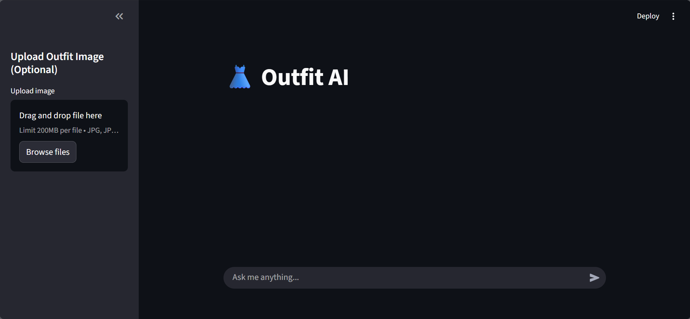

# 👗 Outfit AI

An AI-powered fashion assistant that analyzes outfit images and provides personalized styling suggestions through a conversational chatbot interface.

The application combines **OpenAI CLIP** for outfit classification with **Llama 3 (via Ollama)** to generate natural, context-aware fashion advice.

---

## 📸 Demo

<p align="center">
  
</p>

---

## ✨ Features

- 📷 Upload an outfit image
- 🤖 AI-powered outfit classification using OpenAI CLIP
- 💬 Chat with an AI fashion assistant
- 👕 Personalized outfit recommendations
- 😊 Friendly conversational interface
- ⚡ Local inference using Ollama (Llama 3)
- 🎨 Clean Streamlit-based UI

---

## 🛠️ Tech Stack

| Technology | Purpose |
|------------|---------|
| Python | Backend |
| Streamlit | User Interface |
| OpenAI CLIP | Outfit Classification |
| PyTorch | Deep Learning |
| Ollama | Local LLM Runtime |
| Llama 3 | Conversational AI |
| Pillow | Image Processing |

---

## 📂 Project Structure

```text
OUTFIT-AI/
│
├── app.py
├── clip_utils.py
├── llm_utils.py
├── test_ollama.py
├── requirements.txt
├── README.md
├── .gitignore
│
└── assets/
    └── demo.png
```

---

## ⚙️ Installation

### Clone the repository

```bash
git clone https://github.com/ManyaDhingra/Outfit-AI.git
cd Outfit-AI
```

### Install dependencies

```bash
pip install -r requirements.txt
```

### Install Ollama

Download and install Ollama:

https://ollama.com/download

### Pull the Llama 3 model

```bash
ollama pull llama3
```

### Start Ollama

```bash
ollama serve
```

### Run the application

```bash
streamlit run app.py
```

The application will open in your browser at:

```
http://localhost:8501
```

---

## 🚀 How It Works

1. Upload an outfit image.
2. CLIP analyzes the uploaded image and classifies the outfit.
3. Ask questions about the outfit or chat normally.
4. Llama 3 generates personalized fashion advice based on the detected outfit.

---

## 💡 Example Questions

- Does this outfit look good?
- Is this suitable for a formal event?
- How can I improve this outfit?
- What accessories would match this look?
- Rate this outfit out of 10.

---

## 📌 Future Improvements

- Support multiple outfit images
- Color palette recommendations
- Occasion-based styling suggestions
- Fashion trend analysis
- Brand and clothing item recognition
- Voice interaction
- Image editing and virtual try-on

---

## 👩‍💻 Author

**Manya Dhingra**

GitHub: https://github.com/ManyaDhingra

---

## ⭐ Support

If you found this project useful, consider giving it a ⭐ on GitHub!
